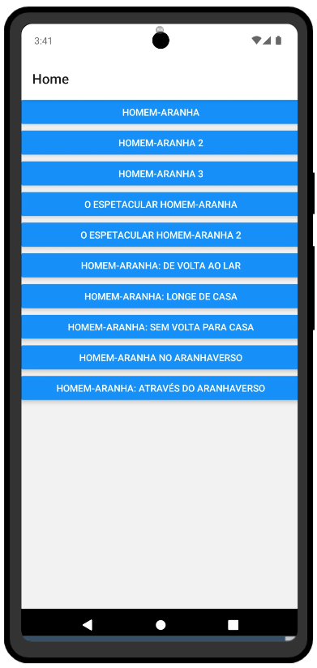
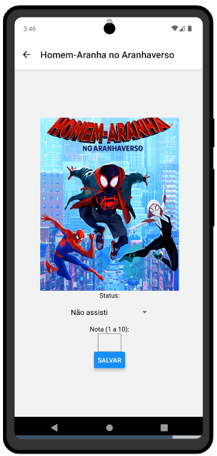

# Projeto 2 de Computação Móvel (CC4670)
- Luís Fernando Souza Gonçalves 24.123.052-3

## Ideia Geral
Este projeto envolve um app desenvolvido em JavaScript utilizando React Native.
O aplicativo serve como um registro de filmes, podendo marcar quais filmes o usuário não assistiu, planeja assistir e já assistiu. Permitindo tambem dar uma nota de 1 a 10 para cada filme.   
(Somente filmes do Homem-Aranha foram implementados no momento porem a idéia seria adicionar diversos filmes).

## Funcionalidades
### Home
O aplicativo abre em uma tela principal onde todos os filmes disponíveis são mostrados em uma lista:

### Filme
Cada item da lista leva a uma página de filme:

Cada filme possui duas propriedades:
- `status`, que indica se o usuario já assistiu o filme;
- `nota`, que indica qual nota o usuario deu ao filme;

Apos alterar as propriedades o usuario deve apertar o botão `Salvar`  para que as alterações sejam salvas utilizando AsyncStorage.
Se tudo funcionar, o dispositivo irá vibrar e um alerta indicará que os dados foram salvos.
